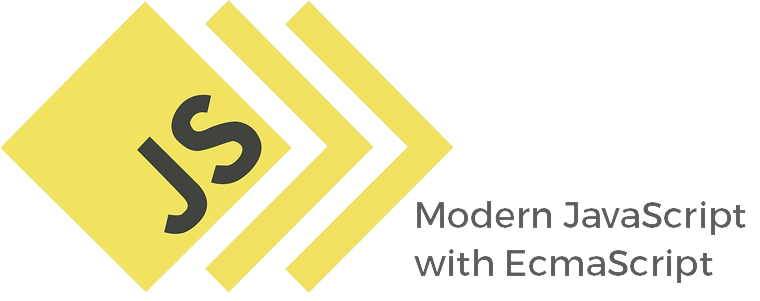

    

<h2 align="center">The Modern Javascript with EcmaScript</h1>

    

This repository contains files referring to the Modern Javascript module of the <a href="https://jstack.com.br/">JStack</a> course!
